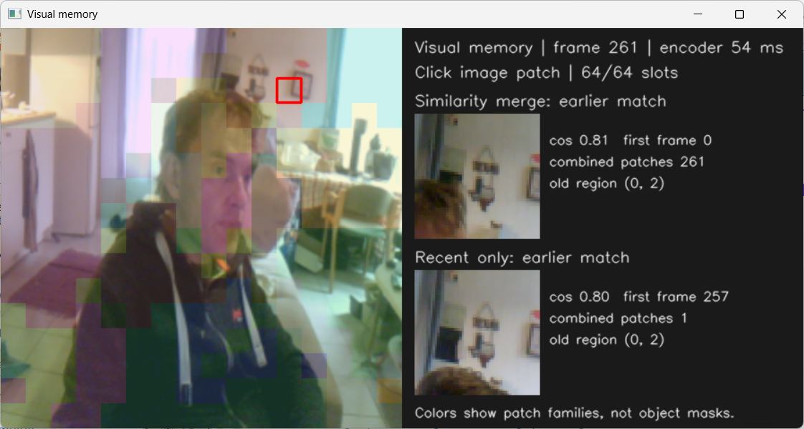

# VisualMemoryDemo



A small local camera/video experiment: **can a fixed number of visual memory slots remember something after a recent-only buffer has forgotten it?** The left image colors patches by their nearest memory slot. Click a patch to see its closest match from **before the current frame**, side by side for similarity merge and a recent-only memory with the same number of slots.

## Run

Python 3.10+; a webcam or local video file:

```bash
python -m pip install -r requirements.txt
python demo.py --source 0
```

The default encoder is frozen [DINOv2-small](https://github.com/facebookresearch/dinov2) (21M parameters). PyTorch Hub downloads the model once. No training, API key, or cloud service is needed. On a machine without a useful PyTorch install, follow [PyTorch's installer](https://pytorch.org/get-started/locally/) for your CPU/CUDA configuration. Slow CPU inference can be eased with `--every 20`.

Click a patch to query old memory; **q** or **Esc** quits; **s** saves the current panel as `visual-memory.png`. Move the same object to a different part of the frame and click it again. The panel shows its earlier matching patch, original coarse region, cosine score and first observed frame. The overlay colors are **patch families, not object segmentation masks**.

A local video can also produce a repeatable demo without a webcam:

```bash
python demo.py --source clip.mp4 --every 5 --headless --output memory.mp4 --max-frames 60
```

`--encoder rgb` explicitly swaps DINOv2 features for simple RGB colors. It is a cheap control for the question “does a pretrained vision model add anything?” The video file and optional screenshots remain local.

## What is compared

Each processed 224×224 frame produces 16×16 patch features. Adjacent features are averaged into 4×4 regions, giving **16 observations per processed frame**. Both memories have 64 slots by default (`--slots` changes both):

- **Similarity merge:** an incoming patch joins its nearest old slot. If it is less similar than the closest *pair of old slots*, that pair merges instead and the new patch gets a slot. Centers are weighted by the number of patches they represent.
- **Recent only:** retain the most recent 64 patch observations and discard older ones.

Each slot also keeps one small representative crop to make a retrieved match visible. A snapshot taken before adding each frame prevents the click query from retrieving itself. No history of old frames is retained in memory. Run the memory tests with `python -m unittest discover -v`.

This is a **new visual experiment built from the merge idea** in [TransformerToX](https://github.com/anttiluode/TransformerToX); its GPT-2/Pythia perplexity results are not results for this video demo. Token merging for vision has extensive [prior work](https://arxiv.org/abs/2210.09461). A slot match is visual similarity, not proven object identity; processing time includes a vision encoder, and the demo does not establish speed, saved GPU memory, or segmentation accuracy. An honest follow-up would label a few moved objects and score retrieval against recent-only and color-only controls.
